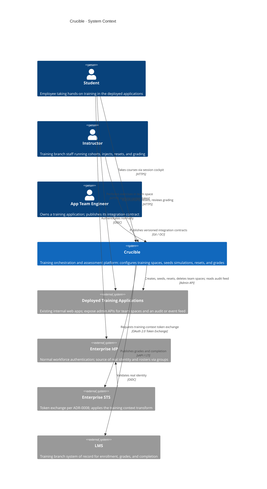
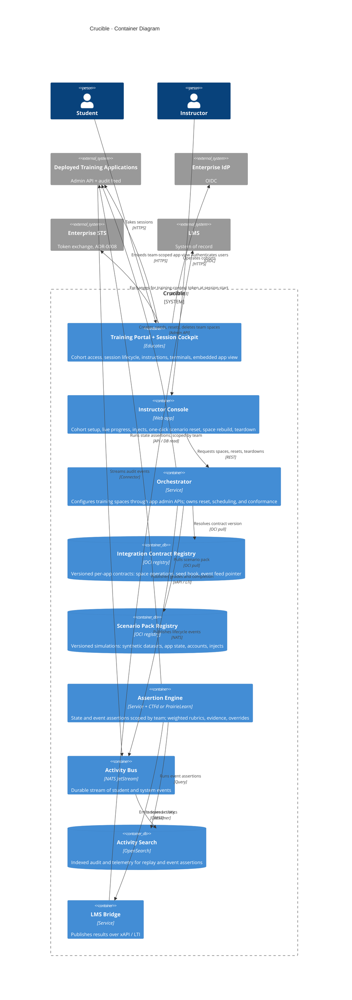
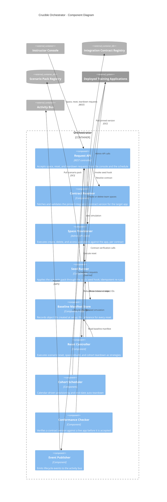
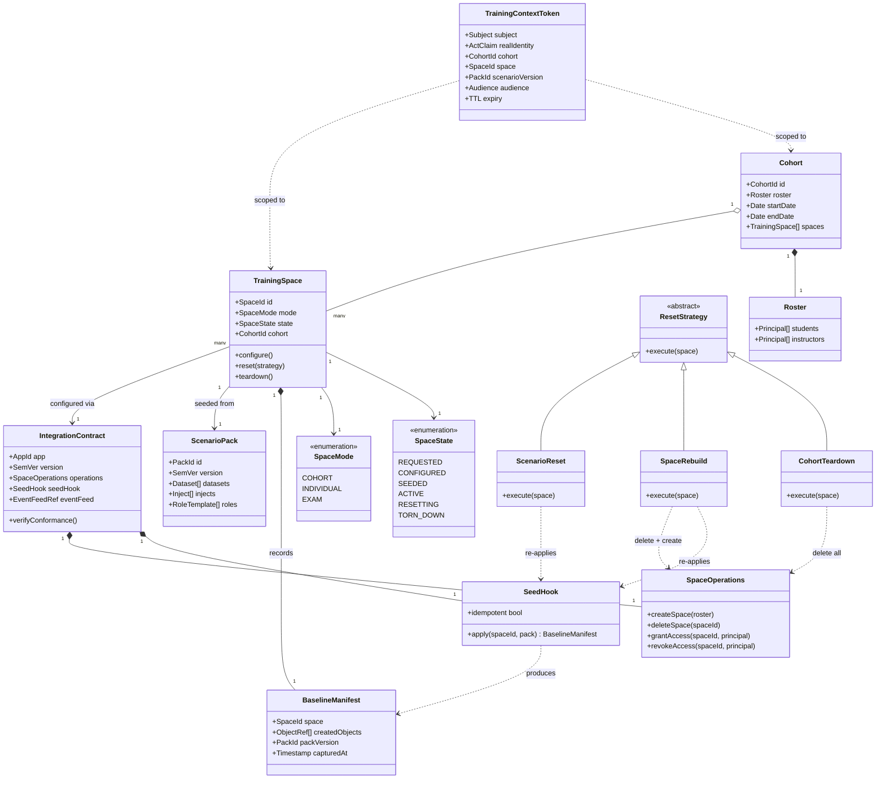

# Crucible · C4 Architecture Diagrams

Diagrams-as-code per ADR-0002 (C4 model with Mermaid). Associated with ADR-0010 (Crucible training space model). Four levels: System Context, Container, Component (Orchestrator), and Code (training space lifecycle domain model).

---

## Level 1 · System Context

Crucible orchestrates training inside the already-deployed internal applications. It configures team spaces and simulations through each app's admin API, transforms identity into a training context via the enterprise STS, grades against application state, and publishes results to the LMS.

---

## Level 2 · Container

Inside Crucible. Adopted open source carries the portal, scoring, and plumbing; the custom containers are the Orchestrator, the Assertion Engine checkers, and the two registries' contracts.

---

## Level 3 · Component (Orchestrator)

Inside the Orchestrator, the core custom container. Every mutation of a training space flows through the Space Provisioner against the app's own admin API; nothing writes to app databases directly.

---

## Level 4 · Code (training space lifecycle domain model)

The domain model behind the Orchestrator, per ADR-0003 (DDD). TrainingSpace is the aggregate root; every reset is a strategy replayed from the contract, the scenario pack version, and the baseline manifest.

---

*Diagram source is canonical; rendered exports are disposable. Changes to these diagrams accompany the ADR that motivates them, per ADR-0002.*
